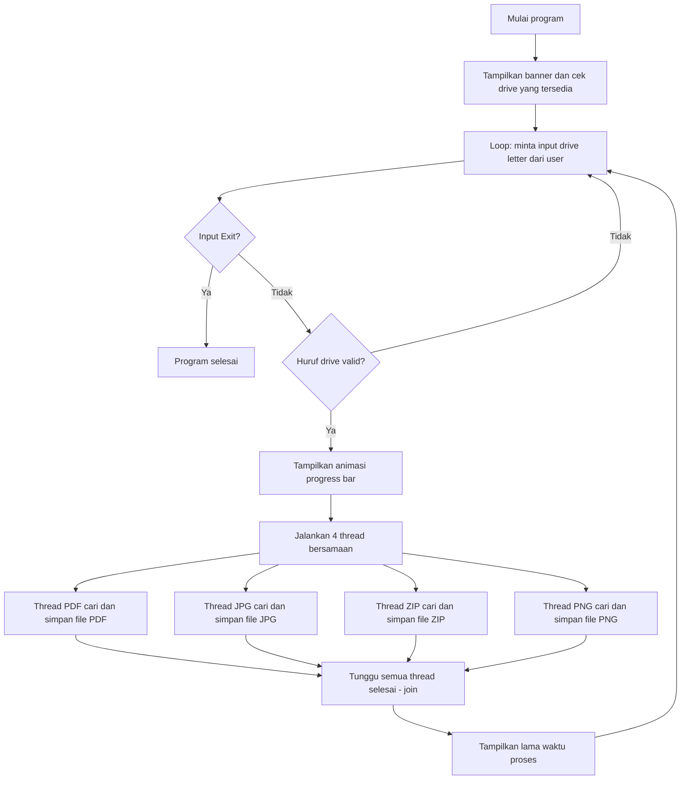

# 📘 Penjelasan Lengkap: Program Data Recovery Tool (Python)

> Dokumen ini menjelaskan **setiap baris kode**, **setiap syntax**, **setiap operasi**, dan **setiap variable** dari program Python yang kamu kasih — ditulis dari nol banget, buat kamu yang baru mulai belajar ngoding. Istilah-istilah teknis (seperti `loop`, `function`, `class`) sengaja dibiarkan dalam bahasa Inggris karena itu istilah yang bakal terus kamu temuin di dunia pemrograman.

## Daftar Isi

1. [Apa Itu Program Ini?](#1-apa-itu-program-ini)
2. [Konsep Dasar Pemrograman yang Perlu Kamu Tahu Dulu](#2-konsep-dasar-pemrograman-yang-perlu-kamu-tahu-dulu)
3. [Kode Lengkap (Referensi)](#3-kode-lengkap-referensi)
4. [Penjelasan Baris per Baris](#4-penjelasan-baris-per-baris)
5. [Alur Program Secara Keseluruhan (Diagram)](#5-alur-program-secara-keseluruhan-diagram)
6. [Konteks Teknis: File Signature dan Raw Disk Access](#6-konteks-teknis-file-signature-dan-raw-disk-access)
7. [Catatan Bug, Kekurangan, dan Saran Perbaikan](#7-catatan-bug-kekurangan-dan-saran-perbaikan)
8. [Rangkuman Semua Variable](#8-rangkuman-semua-variable)
9. [Penutup](#9-penutup)

---

## 1. Apa Itu Program Ini?

Program ini namanya **Data Recovery Tool** — program buat **mengembalikan file yang "hilang"** dari sebuah drive (flashdisk/USB, memory card, harddisk, dll), dengan cara membaca isi drive itu **secara mentah (raw)**, per 512-byte, sambil mencari **"tanda pengenal khusus"** di awal dan akhir tiap jenis file: PDF, JPG, ZIP, dan PNG.

**Analogi sederhana**: bayangin sebuah buku tebal berisi ribuan halaman acak, tanpa daftar isi (ibaratnya isi disk yang datanya masih ada, tapi "peta"-nya udah hilang karena dihapus/format). Program ini baca buku itu halaman demi halaman. Setiap kali nemu kalimat pembuka khas suatu cerita (misalnya "Once upon a time..."), dia mulai nyalin dari situ terus, sampai nemu kalimat penutup khasnya ("...The End"), lalu hasil salinannya disimpan jadi file baru.

Teknik ini di dunia nyata disebut **file carving**, biasa dipakai di bidang **digital forensics** / pemulihan data.

Program ini juga pakai **4 "pekerja" (thread)** yang jalan bersamaan — masing-masing nyari 1 jenis file (PDF, JPG, ZIP, PNG) di waktu yang sama, biar prosesnya (harapannya) lebih cepat.

> ⚠️ **Catatan penting**: Program ini ditulis khusus untuk **Windows** (karena pakai cara akses disk `\\.\` yang cuma ada di Windows), dan biasanya **harus dijalankan sebagai Administrator**. Ini dibahas lengkap di [bagian 6](#6-konteks-teknis-file-signature-dan-raw-disk-access).

---

## 2. Konsep Dasar Pemrograman yang Perlu Kamu Tahu Dulu

Sebelum masuk ke kode aslinya, kita samain dulu pemahaman soal istilah-istilah dasar Python. Kalau nanti di bagian bawah ada istilah yang lupa artinya, kamu bisa balik lagi ke sini.

### 2.1 Variable (Variabel)

Variable itu kayak **kotak yang punya nama**, buat nyimpen suatu nilai/data, supaya bisa dipanggil lagi pakai namanya.

```python
umur = 20         # variable "umur" isinya angka 20
nama = "Budi"      # variable "nama" isinya teks "Budi"
```

Di Python, kamu nggak perlu deklarasi tipe datanya di depan (beda sama bahasa lain kayak Java/C++). Tinggal `nama_variable = nilai`.

### 2.2 Tipe Data (Data Types)

Beberapa tipe data yang muncul di kode kita:

| Tipe Data | Contoh | Keterangan |
|---|---|---|
| `str` (string) | `"pdf"`, `"Exit"` | Teks, diapit tanda kutip `"..."` atau `'...'` |
| `int` (integer) | `50`, `512` | Bilangan bulat |
| `float` | `0.1` | Bilangan desimal |
| `bool` (boolean) | `True`, `False` | Nilai benar/salah, dipakai buat kondisi |
| `list` | `['C', 'D', 'E']` | Kumpulan data berurutan, diapit `[...]` |
| `bytes` | `b'\x25\x50\x44\x46'` | Data biner mentah (dibahas di 2.9) |

### 2.3 Function (Fungsi)

Function itu kayak **mesin**: kamu kasih dia bahan (disebut **parameter/argument**), dia proses, terus (kadang) dia kasih balik hasilnya (disebut **return value**).

```python
def tambah(a, b):        # "def" = bikin function baru namanya "tambah", parameternya a & b
    hasil = a + b
    return hasil          # kasih balik nilai hasil

x = tambah(3, 5)          # manggil function "tambah" dengan argument 3 dan 5 -> x = 8
```

Function nggak wajib punya `return` — kalau nggak ada, function itu cuma "melakukan sesuatu" (misalnya nge-print) tanpa ngasih nilai balik. Di kode kita nanti, function `DataRecovery` dan `progress_bar` termasuk yang **nggak** pakai `return`.

### 2.4 Class & Object (OOP)

Konsep ini agak butuh effort di awal, tapi analoginya gampang: **class itu cetakan kue, object itu kue yang jadi dari cetakan itu.**

```python
class Kucing:                      # bikin "cetakan" bernama Kucing
    def __init__(self, nama):      # __init__ = "resep" yang otomatis jalan tiap ada kue baru dicetak
        self.nama = nama           # simpan "nama" ke object ini sebagai atribut

    def ngeong(self):              # ini disebut "method" -> function yang nempel di class
        print(f"{self.nama} bilang: Ngeooong!")

kucing1 = Kucing("Mochi")    # bikin object baru dari cetakan Kucing, isi resepnya nama="Mochi"
kucing2 = Kucing("Oyen")     # bikin object lain, beda isi (nama="Oyen")

kucing1.ngeong()   # Output: Mochi bilang: Ngeooong!
kucing2.ngeong()   # Output: Oyen bilang: Ngeooong!
```

Poin penting:
- **`class`** = kata kunci buat bikin cetakan/blueprint baru.
- **`__init__`** = method spesial yang otomatis dipanggil setiap kali ada object baru dibuat dari class itu. Sering disebut **constructor**.
- **`self`** = "diri sendiri", dipakai di dalam class buat merujuk ke object yang lagi aktif. Ini **selalu** jadi parameter pertama tiap method dalam class (tapi kamu nggak perlu isi manual pas manggilnya — Python yang isiin otomatis).
- **atribut** = variable yang nempel ke object (misalnya `self.nama`).
- **method** = function yang nempel ke object/class (misalnya `ngeong`).

Di kode kita nanti, ada `class Recovery` yang jadi "cetakan", dan `pdf`, `jpg`, `zip`, `png` adalah 4 "kue" (object) yang dicetak dari situ.

### 2.5 Percabangan (if / elif / else)

Dipakai buat bikin program milih jalan berdasarkan kondisi tertentu — mirip "kalau ini... maka itu... kalau nggak, maka itu."

```python
nilai = 80
if nilai >= 90:
    print("A")
elif nilai >= 70:       # "elif" = "else if", dicek kalau kondisi di atas gagal
    print("B")
else:                     # kalau semua kondisi di atas gagal
    print("C")
```

### 2.6 Perulangan (Loop): `for` dan `while`

Dipakai buat mengulang suatu blok kode berkali-kali, tanpa harus nulis manual berkali-kali.

- **`for`** dipakai kalau kamu tahu persis mau ngulang untuk tiap item di suatu kumpulan/range.

```python
for i in range(3):     # range(3) menghasilkan 0, 1, 2
    print(i)
```

- **`while`** dipakai kalau kamu mau ngulang **selama** suatu kondisi masih benar (`True`), tanpa tahu pasti berapa kali.

```python
i = 0
while i < 3:
    print(i)
    i += 1     # kalau baris ini nggak ada, loop-nya jalan selamanya (infinite loop)!
```

### 2.7 Import & Module

Python udah nyediain banyak "peralatan" siap pakai, dikelompokkan dalam **module**. Supaya bisa dipakai, kita harus **import** dulu.

```python
import os          # module bawaan Python (nggak perlu install)
import pyfiglet     # module PIHAK KETIGA, harus di-install dulu lewat "pip install pyfiglet"
```

`os`, `threading`, `time`, dan `pathlib` itu **built-in** (otomatis ada begitu kamu install Python). Sedangkan `pyfiglet` **bukan** bawaan Python — harus di-install manual pakai `pip install pyfiglet` di terminal, baru bisa di-`import`.

### 2.8 File Handling (Baca/Tulis File)

```python
f = open("data.txt", "r")   # buka file, mode "r" = read (baca)
isi = f.read()
f.close()                     # WAJIB ditutup setelah selesai
```

Mode yang dipakai di kode kita:

| Mode | Arti |
|---|---|
| `"rb"` | **r**ead **b**inary — baca sebagai data biner mentah (bukan teks) |
| `"wb"` | **w**rite **b**inary — nulis sebagai data biner mentah |

Kenapa "binary" dan bukan teks biasa? Karena isi file PDF/JPG/ZIP/PNG itu bukan teks yang bisa dibaca manusia — isinya data biner (kombinasi angka 0-255 per byte), jadi harus dibaca/ditulis apa adanya tanpa "diterjemahkan" ke teks.

### 2.9 Byte & Hexadecimal (Penting Banget di Kode Ini!)

Komputer nyimpen semua data (termasuk isi file) sebagai deretan angka 0-255 per **byte**. Angka ini sering ditulis dalam format **hexadecimal (basis 16)** biar lebih ringkas, ditulis dengan awalan `\x`.

Contoh: `\x25` artinya 1 byte dengan nilai hex `25` (= 37 desimal), yang kalau diterjemahkan ke karakter **ASCII** (sistem standar yang memetakan tiap huruf/simbol ke sebuah angka) adalah simbol `%`.

Di Python, kumpulan byte ditulis dengan awalan huruf `b` sebelum tanda kutip:

```python
b'\x25\x50\x44\x46'   # "bytes object" isinya 4 byte: 0x25, 0x50, 0x44, 0x46
                        # kalau diterjemahkan ke ASCII, ini adalah teks "%PDF"
```

Ini penting karena **setiap jenis file punya "tanda pengenal" unik** di beberapa byte pertama (dan kadang byte terakhir) isinya — disebut **file signature** atau **magic number**. Dibahas lebih detail di [bagian 6](#6-konteks-teknis-file-signature-dan-raw-disk-access).

### 2.10 f-string (String Formatting)

Cara gampang buat "nyelipin" nilai variable ke dalam teks/string, dengan naruh huruf `f` sebelum tanda kutip, dan nama variable di dalam kurung kurawal `{}`.

```python
nama = "Budi"
umur = 20
print(f"Nama saya {nama}, umur {umur} tahun")
# Output: Nama saya Budi, umur 20 tahun
```

### 2.11 Threading (Multi-threading)

Normalnya, program Python jalan **satu baris demi satu baris**, berurutan (disebut **sequential**). **Threading** memungkinkan beberapa bagian program jalan **"bersamaan"** (concurrent).

Analogi: kamu punya 4 tugas rumah (nyapu, ngepel, nyuci piring, beresin kamar). Kalau dikerjain **satu-satu** (sequential), total waktunya = jumlah semua waktu tiap tugas. Kalau kamu punya **4 asisten** yang masing-masing ngerjain 1 tugas **di waktu yang sama** (threading), total waktu bisa jauh lebih cepat.

Di program kita, 4 "asisten" ini masing-masing bertugas nyari 1 jenis file (PDF, JPG, ZIP, PNG) secara bersamaan.

> Catatan: threading nggak selalu bikin lebih cepat kalau ke-4 "asisten" itu rebutan sumber daya yang sama (misalnya disk fisik yang sama) — dibahas lagi di [bagian 7](#7-catatan-bug-kekurangan-dan-saran-perbaikan).

## 3. Kode Lengkap (Referensi)

Ini kode aslinya secara utuh, buat referensi kamu bolak-balik sambil baca penjelasannya di bagian 4:

```python
import os
import threading
import time
import pyfiglet
from pathlib import Path

global letter, recoveredLocation, available_drives, total_iteration

class Recovery:
    def __init__(self, filetype):
        self.filetype = filetype

    def DataRecovery(self, fileName, fileStart, fileEnd, fileOffSet):
        self._fileName = fileName
        self._fileStart = fileStart
        self._fileEnd = fileEnd
        self._fileOffSet = fileOffSet

        drive = f"\\\\.\\{letter}:"
        fileD = open(drive, "rb")
        size = 512
        byte = fileD.read(size)
        offs = 0
        drec = False
        rcvd = 0

        while byte:
            found = byte.find(self._fileStart)
            if found >= 0:
                drec = True
                print(f'==== Found {self._fileName} at location: ' + str(hex(found+(size*offs))) + ' ====')
                fileN = open(f'{recoveredLocation}\\' + str(rcvd) + f'.{self._fileName}', "wb")
                fileN.write(byte[found:])
                while drec:
                    byte = fileD.read(size)
                    bfind = byte.find(self._fileEnd)
                    if bfind >= 0:
                        fileN.write(byte[:bfind+self._fileOffSet])
                        fileD.seek((offs+1)*size)
                        print(f'==== Wrote {self._fileName} to location: ' + str(rcvd) + f'.{self._fileName} ====\n')
                        drec = False
                        rcvd += 1
                        fileN.close()
                    else: fileN.write(byte)
            byte = fileD.read(size)
            offs += 1
        fileD.close()

def progress_bar(t_i, c_i, bar_length, fill):
    percent = f"{100 * c_i / float(t_i):.1f}"
    percent = 100 * c_i / float(t_i)
    fill_length = bar_length * c_i // t_i
    bar = fill * fill_length + "-" * (bar_length - fill_length)
    print(f"\rLoading: |{bar}| {percent}%", end="")
    if c_i == t_i:
        print("\nRunning.........")

print("="*100)
print(pyfiglet.figlet_format("Data Recovey Tool", font='starwars',justify="center", width=100))
print("="*100)


total_iteration = 50

available_drives = [ chr(x) + "" for x in range(65,91) if os.path.exists(chr(x) + ":") ]
cwd = Path.cwd()
recoveredLocation = cwd / 'RecoveredData'
recoveredLocation.mkdir(exist_ok=True)
print(f'Recoved data will be saved to {recoveredLocation}')
print(f"Available Drives are: {available_drives}")

pdf = Recovery('pdf')
jpg = Recovery('jpg')
zip = Recovery('zip')
png = Recovery('png')

while True:
    letter = input("Enter Removable Drive Letter Or 'Exit' to quit the program: ").capitalize()
    if letter == "Exit" or letter == "exit" or letter == "EXIT":
        break
    elif letter[0] in available_drives:
        for i in range(total_iteration + 1):
            progress_bar(total_iteration, i, 15, ">")
            time.sleep(0.1)

        thread1 = threading.Thread(target=pdf.DataRecovery, args=('pdf', b'\x25\x50\x44\x46\x2D', b'\x0a\x25\x25\x45\x4f\x46', 6))
        thread2 = threading.Thread(target=jpg.DataRecovery, args=('jpg', b'\xff\xd8\xff\xe0\x00\x10\x4a\x46', b'\xff\xd9', 2))
        thread3 = threading.Thread(target=zip.DataRecovery, args=('zip', b'\x50\x4b\x03\x04\x14', b'\x50\x4b\x05\x06', 4))
        thread4 = threading.Thread(target=png.DataRecovery, args=('png', b'\x89\x50\x4e\x47', b'\x49\x45\x4e\x44\xae\x42\x60\x82', 8))

        startpy = time.time()
        thread1.start()
        thread2.start()
        thread3.start()
        thread4.start()
        thread1.join()
        thread2.join()
        thread3.join()
        thread4.join()
        endpy = time.time()
        print(endpy-startpy)
```

---

## 4. Penjelasan Baris per Baris

Sekarang kita bedah kode di atas, potong per potong, dari atas ke bawah.

### 4.1 Import Module dan Deklarasi Global

```python
import os
import threading
import time
import pyfiglet
from pathlib import Path

global letter, recoveredLocation, available_drives, total_iteration
```

**4 baris `import ...`**: ini "mengaktifkan" module supaya semua tools di dalamnya bisa dipakai:
- `os` → berinteraksi dengan sistem operasi (misal: ngecek apakah suatu drive ada).
- `threading` → bikin program bisa jalanin beberapa tugas bersamaan (lihat 2.11).
- `time` → hal terkait waktu, misal bikin program "nunggu" (`time.sleep`) atau ngukur lama proses (`time.time`).
- `pyfiglet` → bikin tulisan jadi "ASCII art" (tulisan besar dari susunan karakter, biasa buat banner di terminal). Ini module pihak ketiga.

**`from pathlib import Path`**: sedikit beda dari `import` biasa. `pathlib` adalah module buat kerja dengan **path/lokasi file & folder** secara modern. `from pathlib import Path` artinya "dari module `pathlib`, ambil cuma bagian `Path`-nya aja", jadi nanti kita bisa langsung nulis `Path(...)` tanpa perlu `pathlib.Path(...)`.

**`global letter, recoveredLocation, available_drives, total_iteration`**: kata kunci `global` biasanya dipakai **di dalam function**, buat bilang "variable ini bukan variable baru punya function ini, tapi variable yang udah ada di level program utama". 

> ⚠️ **Catatan**: di kode ini, baris `global` ditulis **di luar function manapun** (di level paling atas program). Ini sebenarnya **nggak ngefek apa-apa**, karena semua variable yang dideklarasikan di level paling atas program **memang otomatis** sudah jadi variable global. Jadi baris ini cuma "catatan pengingat" buat programmer-nya sendiri, bukan sesuatu yang mengubah cara kerja program. Detail lengkap ada di [bagian 7.2](#7-catatan-bug-kekurangan-dan-saran-perbaikan).

Variable yang disebut di sini (`letter`, `recoveredLocation`, `available_drives`, `total_iteration`) belum diisi nilai apa-apa — baru bakal diisi belakangan.

### 4.2 Class Recovery dan Constructor-nya

```python
class Recovery:
    def __init__(self, filetype):
        self.filetype = filetype
```

- **`class Recovery:`** → bikin "cetakan"/blueprint baru bernama `Recovery`. Nanti dari cetakan ini kita bikin 4 "kue" (object): satu buat PDF, satu buat JPG, satu buat ZIP, satu buat PNG.
- **`def __init__(self, filetype):`** → constructor (lihat 2.4), otomatis jalan tiap kali ada object `Recovery` baru dibuat. Parameternya `filetype`.
- **`self.filetype = filetype`** → menyimpan nilai `filetype` yang dikasih sebagai atribut object ini (`self.filetype`), supaya bisa dipanggil lagi nanti.

> 🔍 Menariknya, atribut `self.filetype` ini **nggak pernah dipakai lagi** di bagian kode manapun setelah ini (lihat [bagian 7.3](#7-catatan-bug-kekurangan-dan-saran-perbaikan)). Info jenis file yang beneran dipakai justru dikirim ulang lewat parameter method `DataRecovery` di bawah.

### 4.3 Awal Method DataRecovery — Persiapan

```python
    def DataRecovery(self, fileName, fileStart, fileEnd, fileOffSet):
        self._fileName = fileName
        self._fileStart = fileStart
        self._fileEnd = fileEnd
        self._fileOffSet = fileOffSet

        drive = f"\\\\.\\{letter}:"
        fileD = open(drive, "rb")
        size = 512
        byte = fileD.read(size)
        offs = 0
        drec = False
        rcvd = 0
```

Ini method paling penting di seluruh program — di sinilah proses "pencarian & penyelamatan file" beneran terjadi.

**Parameter method ini** (contoh nilai untuk PDF):

| Parameter | Contoh Nilai | Artinya |
|---|---|---|
| `fileName` | `'pdf'` | nama/ekstensi jenis file yang dicari |
| `fileStart` | `b'\x25\x50\x44\x46\x2D'` | pola byte penanda **awal** file (signature awal) |
| `fileEnd` | `b'\x0a\x25\x25\x45\x4f\x46'` | pola byte penanda **akhir** file (signature akhir) |
| `fileOffSet` | `6` | berapa byte tambahan diikutkan setelah lokasi `fileEnd` ditemukan, biar signature akhirnya lengkap ke-include |

**`self._fileName = fileName`** (dan 3 baris setelahnya): menyimpan ke-4 parameter tadi sebagai atribut object (`self._fileName`, dst), supaya bisa dipakai di baris-baris berikutnya dalam method yang sama. (Nama yang diawali garis bawah `_` cuma konvensi penamaan yang menandakan "atribut internal buat class ini" — bukan aturan wajib Python.)

**`drive = f"\\\\.\\{letter}:"`** — bikin sebuah string path spesial. Mari kita bedah backslash-nya satu-satu (ini bagian yang sering bikin bingung pemula):
- Di dalam string Python, `\\` (backslash ganda) artinya "1 karakter backslash asli" (backslash itu karakter spesial, jadi kalau mau nulis 1 backslash asli, ditulis dobel).
- `\\\\` (4 backslash di kode) → jadi **2 backslash asli**.
- `\\` (2 backslash, sebelum titik) → jadi **1 backslash asli**.
- Jadi kalau `letter` isinya `"E"`, hasil akhirnya adalah string: **`\\.\E:`**

Format `\\.\X:` ini adalah cara khusus di **Windows** buat mengakses sebuah drive secara **mentah/raw** (bukan lewat sistem file biasa). Dibahas lebih detail di [bagian 6](#6-konteks-teknis-file-signature-dan-raw-disk-access).

**`fileD = open(drive, "rb")`** — membuka drive tadi buat dibaca sebagai data biner mentah (lihat 2.8). Variable `fileD` sekarang menyimpan "akses" ke drive tersebut.

**`size = 512`** — ukuran (dalam byte) yang dibaca setiap kali. Angka 512 bukan asal pilih — itu **ukuran sektor standar** pada kebanyakan hard disk/storage (unit terkecil penyimpanan fisik pada disk).

**`byte = fileD.read(size)`** — membaca 512 byte pertama dari drive, disimpan ke variable `byte`.

**`offs = 0`** — counter buat ngitung "blok/sektor keberapa" yang lagi diproses, dimulai dari 0. Dipakai buat ngitung lokasi (offset) file yang ketemu.

**`drec = False`** — sebuah **boolean flag** (penanda benar/salah). `drec` dipakai buat nandain: "apakah program lagi di tengah-tengah proses nyalin sebuah file yang ketemu?" `False` artinya belum.

**`rcvd = 0`** — counter jumlah file yang **sudah berhasil** diselamatkan sejauh ini, dimulai dari 0. Dipakai buat kasih nama file hasil (`0.pdf`, `1.pdf`, dst).

### 4.4 Loop Utama dan Mencari Tanda Awal File

```python
        while byte:
            found = byte.find(self._fileStart)
            if found >= 0:
                drec = True
                print(f'==== Found {self._fileName} at location: ' + str(hex(found+(size*offs))) + ' ====')
                fileN = open(f'{recoveredLocation}\\' + str(rcvd) + f'.{self._fileName}', "wb")
                fileN.write(byte[found:])
```

**`while byte:`** — perulangan yang jalan terus **selama** `byte` "bernilai benar" (truthy). Bytes kosong (`b''`) dianggap `False` di Python, jadi loop ini otomatis berhenti kalau `fileD.read()` udah nggak ada lagi yang bisa dibaca (artinya sudah sampai ujung drive).

**`found = byte.find(self._fileStart)`** — `.find()` adalah method bawaan bytes/string, mencari posisi (index) pertama kali suatu pola ditemukan.
- Kalau **ketemu**, hasilnya **angka index** (posisi, dimulai dari 0) tempat pola itu **mulai**.
- Kalau **nggak ketemu**, hasilnya `-1`.

Jadi baris ini nyari: "apakah di 512 byte yang baru dibaca ini, ada pola byte pembuka file (misalnya `%PDF-` buat PDF)?"

**`if found >= 0:`** — kalau `found` bukan `-1` (artinya: ketemu!), masuk ke blok kode di bawahnya.

**`drec = True`** — nyalain flag "lagi proses nyalin file".

**`print(f'==== Found ... ====')`** — nampilin pesan ke layar. Perhatikan gaya penulisannya nyampur f-string dengan operator `+` buat gabung string — valid, tapi sedikit nggak konsisten gayanya. Bagian `str(hex(found+(size*offs)))` menghitung **posisi absolut** (dari awal drive) tempat file ditemukan:
  - `size*offs` = posisi awal blok yang lagi diproses.
  - `found` = posisi relatif di dalam blok saat ini.
  - Jumlah keduanya = posisi sebenarnya dari awal drive.
  - `hex(...)` mengubah angka itu ke format heksadesimal (misal `0x1a400`), lalu `str(...)` memastikan hasilnya jadi teks biar bisa digabung pakai `+`.

**`fileN = open(f'{recoveredLocation}\\' + str(rcvd) + f'.{self._fileName}', "wb")`** — bikin & membuka file **baru** buat nulis (mode `"wb"`), dengan nama contohnya `RecoveredData\0.pdf` (gabungan folder tujuan + counter `rcvd` + titik + jenis file). File inilah yang bakal jadi hasil file yang "diselamatkan".

**`fileN.write(byte[found:])`** — pakai **slicing** (`[found:]` artinya "ambil dari index `found` sampai akhir"). Ini menulis isi block saat ini, **mulai dari tempat ditemukannya tanda pembuka file**, sampai akhir blok 512-byte tadi, ke file baru.

### 4.5 Loop Dalam — Mencari Tanda Akhir File

```python
                while drec:
                    byte = fileD.read(size)
                    bfind = byte.find(self._fileEnd)
                    if bfind >= 0:
                        fileN.write(byte[:bfind+self._fileOffSet])
                        fileD.seek((offs+1)*size)
                        print(f'==== Wrote {self._fileName} to location: ' + str(rcvd) + f'.{self._fileName} ====\n')
                        drec = False
                        rcvd += 1
                        fileN.close()
                    else: fileN.write(byte)
```

Ini **loop di dalam loop** (nested loop) — jalan selama `drec` masih `True`, artinya "selama belum ketemu tanda penutup file".

**`byte = fileD.read(size)`** — baca lagi 512 byte **berikutnya** dari drive (lanjut dari posisi terakhir baca).

**`bfind = byte.find(self._fileEnd)`** — sama seperti sebelumnya, tapi sekarang nyari pola **penutup** file (misalnya `\n%%EOF` buat PDF) di blok yang baru dibaca ini.

**`if bfind >= 0:`** — kalau tanda penutup **ketemu** di blok ini:
- **`fileN.write(byte[:bfind+self._fileOffSet])`** — slicing `[:bfind+fileOffSet]` artinya "ambil dari **awal** blok sampai index `bfind+fileOffSet`". Kenapa ditambah `fileOffSet`? Supaya seluruh pola penutup ikut ke-tulis (nggak kepotong di tengah pola) — `fileOffSet` sengaja diisi sama panjangnya dengan pola `fileEnd` itu sendiri.
- **`fileD.seek((offs+1)*size)`** — `.seek()` memindahkan "posisi baca" (kayak nge-drag slider video ke waktu tertentu). Baris ini memindahkan posisi baca **kembali** ke awal blok setelah blok tempat tanda pembuka ditemukan. Area drive yang baru aja dibaca ekstra (buat nyari tanda penutup) jadi **dibaca ulang** lagi nanti — ini disengaja, supaya kalau ada file lain yang "nyempil"/tumpang tindih di area itu, tetap bisa ketemu (walau jadi boros baca beberapa bagian dua kali).
- **`print(...)`** — nampilin pesan "berhasil disimpan".
- **`drec = False`** — matiin flag, artinya proses nyalin file ini sudah selesai.
- **`rcvd += 1`** — nambah counter jumlah file yang berhasil diselamatkan (`+= 1` artinya "tambah 1 dari nilai sekarang", sama aja kayak `rcvd = rcvd + 1`).
- **`fileN.close()`** — **wajib** ditutup setelah selesai nulis, supaya datanya beneran "disimpan" ke disk dan file-nya bisa dibuka program lain.

**`else: fileN.write(byte)`** — kalau tanda penutup **belum** ketemu di blok ini, tulis **semua** isi blok ini ke file (karena masih bagian tengah dari file yang lagi diselamatkan), lalu lanjut loop lagi.

### 4.6 Penutup Loop Utama pada DataRecovery

```python
            byte = fileD.read(size)
            offs += 1
        fileD.close()
```

**`byte = fileD.read(size)`** (baris ini sejajar dengan `if found >= 0:`, artinya **selalu** dijalankan tiap akhir satu putaran `while byte:`, baik tadi ketemu tanda pembuka atau nggak) — baca 512 byte **berikutnya**, buat diperiksa di putaran loop selanjutnya.

**`offs += 1`** — nambah counter blok, supaya perhitungan lokasi (offset) di baris-baris sebelumnya tetap akurat.

**`fileD.close()`** — kalau `while byte:` sudah berhenti (karena `byte` sudah kosong, tandanya sudah sampai ujung drive), tutup akses ke drive. Ini baris terakhir di method `DataRecovery`.

### 4.7 Function progress_bar

```python
def progress_bar(t_i, c_i, bar_length, fill):
    percent = f"{100 * c_i / float(t_i):.1f}"
    percent = 100 * c_i / float(t_i)
    fill_length = bar_length * c_i // t_i
    bar = fill * fill_length + "-" * (bar_length - fill_length)
    print(f"\rLoading: |{bar}| {percent}%", end="")
    if c_i == t_i:
        print("\nRunning.........")
```

Function ini (bukan method dalam class, tapi function biasa/mandiri) buat nampilin animasi "progress bar" (bar loading) di layar terminal.

**Parameter:**
- `t_i` = **t**otal **i**teration (target/jumlah total langkah)
- `c_i` = **c**urrent **i**teration (langkah keberapa sekarang)
- `bar_length` = panjang bar (dalam jumlah karakter)
- `fill` = karakter buat "ngisi" bagian bar yang sudah selesai (misalnya `">"`)

**`percent = f"{100 * c_i / float(t_i):.1f}"`** — menghitung persentase progress (`current/total * 100`), diformat pakai f-string dengan `:.1f` yang artinya "tampilkan sebagai desimal dengan 1 angka di belakang koma" (misalnya `42.0`). Hasilnya berupa **string** (teks).

> ⚠️ **Catatan bug**: baris ini langsung **ditimpa** oleh baris berikutnya sebelum sempat dipakai — lihat [bagian 7.4](#7-catatan-bug-kekurangan-dan-saran-perbaikan).

**`percent = 100 * c_i / float(t_i)`** — menghitung ulang persentase yang sama, tapi kali ini `percent` jadi bilangan **desimal (float)** biasa, bukan string yang sudah diformat rapi. `float(t_i)` memastikan pembagian menghasilkan desimal (bukan cuma pembagian bilangan bulat).

**`fill_length = bar_length * c_i // t_i`** — menghitung berapa banyak karakter bar yang harus "terisi" sejauh ini. `//` adalah **pembagian bulat** (floor division) — hasilnya dibulatkan ke bawah jadi bilangan bulat (karena jumlah karakter nggak mungkin pecahan).

**`bar = fill * fill_length + "-" * (bar_length - fill_length)`** — bikin teks bar-nya:
- `fill * fill_length` → mengulang karakter `fill` (misal `">"`) sebanyak `fill_length` kali. Di Python, mengalikan **string** dengan **angka** artinya "ulangi string itu sebanyak angka tersebut" — misalnya `"ab" * 3` hasilnya `"ababab"`.
- `"-" * (bar_length - fill_length)` → sisa bar diisi karakter `-` (strip), sebanyak sisa yang belum terisi.
- Kedua bagian digabung pakai `+` (operator gabung string).

**`print(f"\rLoading: |{bar}| {percent}%", end="")`** — nampilin bar-nya.
- `\r` (**c**arriage **r**eturn) adalah karakter spesial yang bikin kursor tulisan "balik ke awal baris yang sama" (tanpa pindah baris baru). Efeknya, tulisan yang baru di-print bakal **menimpa** tulisan lama di baris yang sama, bikin efek animasi loading yang keliatan "hidup" di tempat.
- `end=""` — secara default, `print()` selalu nambahin baris baru (newline) di akhir. `end=""` bikin `print()` **nggak** pindah baris, biar `print` berikutnya masih nimpa di baris yang sama juga.

**`if c_i == t_i: print("\nRunning.........")`** — kalau progress sudah 100% (current == total), baru pindah baris (`\n`) dan nampilin pesan "Running........." menandakan animasi loading-nya selesai.

### 4.8 Menampilkan Banner atau Judul Program

```python
print("="*100)
print(pyfiglet.figlet_format("Data Recovey Tool", font='starwars',justify="center", width=100))
print("="*100)
```

**`print("="*100)`** — nge-print garis pemisah, dari 100 karakter `=` yang diulang (konsepnya sama kayak `bar` tadi: string dikali angka = diulang).

**`pyfiglet.figlet_format(...)`** — memanggil function `figlet_format` dari module `pyfiglet`, buat mengubah teks biasa jadi **ASCII art**. Parameternya:
- `"Data Recovey Tool"` → teks yang mau diubah (perhatikan ada typo "Recovey" harusnya "Recovery" — cuma salah ketik, nggak mempengaruhi jalannya program).
- `font='starwars'` → gaya/jenis font ASCII art yang dipakai.
- `justify="center"` → teks diratakan ke tengah.
- `width=100` → lebar area (dalam karakter) buat nge-pas-in tulisannya.

Hasilnya (string ASCII art panjang) langsung dibungkus `print(...)` biar tampil di layar.

### 4.9 Menyiapkan Variable dan Folder Penyimpanan

```python
total_iteration = 50

available_drives = [ chr(x) + "" for x in range(65,91) if os.path.exists(chr(x) + ":") ]
cwd = Path.cwd()
recoveredLocation = cwd / 'RecoveredData'
recoveredLocation.mkdir(exist_ok=True)
print(f'Recoved data will be saved to {recoveredLocation}')
print(f"Available Drives are: {available_drives}")
```

**`total_iteration = 50`** — mengisi variable global yang tadi cuma "dijanjikan" di bagian 4.1, sekarang beneran diisi angka `50`. Ini menentukan berapa langkah animasi progress bar nanti.

**`available_drives = [ chr(x) + "" for x in range(65,91) if os.path.exists(chr(x) + ":") ]`** — ini disebut **list comprehension**, cara ringkas Python buat bikin `list` baru dari sebuah proses looping + filter, dalam 1 baris. Mari kita baca dari dalam ke luar:
- `range(65, 91)` → menghasilkan urutan angka 65 sampai 90 (91 nggak termasuk). Ini adalah **kode ASCII** untuk huruf `A` (65) sampai `Z` (90).
- `chr(x)` → mengubah kode ASCII (angka) jadi karakter huruf yang sesuai. Contoh: `chr(65)` = `"A"`.
- `+ ""` → menambahkan string kosong; ini sebenarnya **nggak ngubah apa-apa** (lihat [bagian 7.5](#7-catatan-bug-kekurangan-dan-saran-perbaikan)).
- `if os.path.exists(chr(x) + ":")` → syarat/filter: cuma masukin huruf itu ke list **kalau** path seperti `"C:"` atau `"D:"` itu **ada/valid** di komputer ini (cara ini dipakai buat ngecek drive mana aja yang aktif/terpasang di Windows).
- Jadi keseluruhan baris ini artinya: "bikin list berisi semua huruf drive (A sampai Z) yang benar-benar ada/terpasang di komputer ini." Hasilnya misalnya `['C', 'D', 'E']`.

**`cwd = Path.cwd()`** — `Path` adalah class yang kita import dari `pathlib` di awal. `.cwd()` adalah method yang ngasih tahu **lokasi folder tempat program ini sedang dijalankan** (**c**urrent **w**orking **d**irectory), dalam bentuk object `Path`.

**`recoveredLocation = cwd / 'RecoveredData'`** — ini terlihat aneh kalau belum tahu `pathlib`: kenapa `Path` bisa "dibagi" (`/`) sama string biasa? Ini karena class `Path` sengaja "membajak arti" operator `/` (disebut **operator overloading**), supaya `/` bisa dipakai buat **menggabung path folder** dengan cara yang gampang dibaca. Jadi ini artinya: "gabungkan folder `cwd` dengan sub-folder bernama `RecoveredData`" — hasilnya path baru.

**`recoveredLocation.mkdir(exist_ok=True)`** — `.mkdir()` bikin folder itu beneran (kalau belum ada). Parameter `exist_ok=True` artinya "kalau ternyata foldernya sudah ada duluan, jangan error, lanjut aja" (defaultnya, `mkdir()` tanpa parameter ini bakal **error** kalau foldernya sudah ada).

**2 baris `print(...)` terakhir** — cuma nampilin info ke layar: lokasi folder penyimpanan hasil recovery, dan daftar drive yang tersedia.

### 4.10 Membuat 4 Object dari Class Recovery

```python
pdf = Recovery('pdf')
jpg = Recovery('jpg')
zip = Recovery('zip')
png = Recovery('png')
```

Ini bikin **4 object** ("4 kue") dari **1 class** `Recovery` ("1 cetakan") yang sudah kita bahas di bagian 4.2. Tiap object dikasih nilai `filetype` yang beda-beda saat dibuat (`'pdf'`, `'jpg'`, `'zip'`, `'png'`), yang otomatis ke-trigger lewat `__init__`.

> ⚠️ **Catatan bug**: variable ketiga dinamai `zip` — ini menimpa/menutupi nama `zip()` yang sebenarnya sudah jadi **function bawaan Python**. Lihat [bagian 7.1](#7-catatan-bug-kekurangan-dan-saran-perbaikan).

Setelah baris ini, kita punya 4 object siap pakai: `pdf`, `jpg`, `zip`, `png` — masing-masing nantinya bakal manggil method `.DataRecovery(...)` miliknya sendiri-sendiri.

### 4.11 Loop Utama Program — Meminta Input dari User

```python
while True:
    letter = input("Enter Removable Drive Letter Or 'Exit' to quit the program: ").capitalize()
    if letter == "Exit" or letter == "exit" or letter == "EXIT":
        break
    elif letter[0] in available_drives:
```

**`while True:`** — perulangan **tanpa henti** (infinite loop), karena kondisinya selalu `True`. Ini pola umum buat program yang mau terus "nunggu input dari user" berkali-kali, sampai user sendiri yang minta berhenti.

**`letter = input("...")`** — `input()` adalah function bawaan buat nampilin sebuah pesan/prompt, lalu **menunggu user mengetik sesuatu** dan menekan Enter. Apapun yang diketik user (selalu dalam bentuk `string`) disimpan ke variable `letter`.

**`.capitalize()`** — method bawaan `string`, mengubah **huruf pertama jadi kapital, sisanya jadi huruf kecil semua**. Misalnya `"exit"` → `"Exit"`, `"EXIT"` → `"Exit"`, `"e"` → `"E"`.

**`if letter == "Exit" or letter == "exit" or letter == "EXIT":`** — cek apakah user ingin keluar dari program. `or` artinya "salah satu aja benar, sudah cukup".

> ⚠️ **Catatan bug**: karena `letter` sudah "dipaksa" jadi format `.capitalize()` di baris sebelumnya, hasilnya **cuma mungkin** `"Exit"` — nggak akan pernah jadi `"exit"` atau `"EXIT"`. Jadi 2 pengecekan tambahan itu **percuma/nggak akan pernah kepakai**. Lihat [bagian 7.6](#7-catatan-bug-kekurangan-dan-saran-perbaikan).

**`break`** — kata kunci buat **langsung keluar** dari loop yang sedang berjalan (di sini, keluar dari `while True:`), tanpa peduli kondisi loop-nya.

**`elif letter[0] in available_drives:`** — kalau user nggak mau exit, cek: apakah **huruf pertama** dari input user (`letter[0]` — pakai **indexing**, `[0]` artinya "karakter di posisi ke-0/pertama") ada **di dalam** (`in`) list `available_drives` yang sudah kita hitung di awal tadi. `in` adalah operator buat ngecek keanggotaan dalam suatu kumpulan (list/string/dll).

### 4.12 Menjalankan Animasi Progress Bar

```python
        for i in range(total_iteration + 1):
            progress_bar(total_iteration, i, 15, ">")
            time.sleep(0.1)
```

**`for i in range(total_iteration + 1):`** — perulangan sebanyak `total_iteration + 1` kali (51 kali, karena `total_iteration = 50`, dan `range` butuh `+1` supaya `i` sempat mencapai nilai `50` juga, bukan cuma sampai `49`). Variable `i` akan bernilai `0, 1, 2, ..., 50` secara berurutan.

**`progress_bar(total_iteration, i, 15, ">")`** — memanggil function `progress_bar` (bagian 4.7), dengan: total = 50, current = `i` (berubah tiap putaran), panjang bar = 15 karakter, karakter pengisi = `">"`.

**`time.sleep(0.1)`** — bikin program "diam"/nunggu selama 0.1 detik sebelum lanjut ke putaran berikutnya. Ini murni biar animasinya keliatan pelan-pelan.

> ⚠️ **Catatan penting**: Loop ini **cuma animasi kosmetik** dan **nggak ada hubungannya sama sekali** dengan proses recovery yang sesungguhnya. Proses recovery yang beneran baru dimulai **setelah** animasi ini selesai. Lihat [bagian 7.10](#7-catatan-bug-kekurangan-dan-saran-perbaikan).

### 4.13 Menyiapkan 4 Thread

```python
        thread1 = threading.Thread(target=pdf.DataRecovery, args=('pdf', b'\x25\x50\x44\x46\x2D', b'\x0a\x25\x25\x45\x4f\x46', 6))
        thread2 = threading.Thread(target=jpg.DataRecovery, args=('jpg', b'\xff\xd8\xff\xe0\x00\x10\x4a\x46', b'\xff\xd9', 2))
        thread3 = threading.Thread(target=zip.DataRecovery, args=('zip', b'\x50\x4b\x03\x04\x14', b'\x50\x4b\x05\x06', 4))
        thread4 = threading.Thread(target=png.DataRecovery, args=('png', b'\x89\x50\x4e\x47', b'\x49\x45\x4e\x44\xae\x42\x60\x82', 8))
```

Ini bikin **4 object Thread** (lihat konsep di 2.11), masing-masing bertugas menjalankan method `.DataRecovery` dari salah satu object (`pdf`, `jpg`, `zip`, `png`) — tapi **belum dijalankan** di baris ini, cuma "disiapkan" dulu.

`threading.Thread(...)` menerima 2 parameter penting di sini:
- **`target=...`** → function/method mana yang mau dijalankan thread ini. Contoh: `target=pdf.DataRecovery` artinya "kalau thread ini jalan, panggil method `DataRecovery` milik object `pdf`".
- **`args=(...)`** → kumpulan argument (dalam bentuk **tuple**, ditandai kurung `()`) yang bakal dikirim ke method tadi. Method `DataRecovery` butuh parameter `(self, fileName, fileStart, fileEnd, fileOffSet)` — karena ini dipanggil lewat object (`pdf.DataRecovery`), Python otomatis sudah ngisi `self`-nya, jadi kita cuma perlu kasih 4 argument sisanya lewat `args`.

Berikut rincian tiap thread beserta signature byte-nya (dibahas lebih detail secara konsep di [bagian 6](#6-konteks-teknis-file-signature-dan-raw-disk-access)):

| Thread | fileName | fileStart (hex) | fileEnd (hex) | fileOffSet |
|---|---|---|---|---|
| thread1 | `'pdf'` | `25 50 44 46 2D` (`%PDF-`) | `0A 25 25 45 4F 46` (`\n%%EOF`) | `6` |
| thread2 | `'jpg'` | `FF D8 FF E0 00 10 4A 46` | `FF D9` | `2` |
| thread3 | `'zip'` | `50 4B 03 04 14` | `50 4B 05 06` | `4` |
| thread4 | `'png'` | `89 50 4E 47` | `49 45 4E 44 AE 42 60 82` | `8` |

Perhatikan pola di setiap baris: angka `fileOffSet` selalu **sama dengan jumlah byte** di `fileEnd`-nya (6 byte untuk PDF → offset 6, 2 byte untuk JPG → offset 2, dst). Ini bukan kebetulan — tujuannya seperti dijelaskan di bagian 4.5, supaya keseluruhan tanda penutup ikut tersalin lengkap.

### 4.14 Menjalankan Semua Thread dan Mengukur Waktu

```python
        startpy = time.time()
        thread1.start()
        thread2.start()
        thread3.start()
        thread4.start()
        thread1.join()
        thread2.join()
        thread3.join()
        thread4.join()
        endpy = time.time()
        print(endpy-startpy)
```

**`startpy = time.time()`** — `time.time()` ngasih "stempel waktu" saat ini (dalam detik, dihitung dari 1 Januari 1970 — disebut **Unix timestamp**, standar umum di dunia komputer). Disimpan sebagai "penanda waktu mulai".

**`thread1.start()` sampai `thread4.start()`** — `.start()` beneran **menjalankan** thread-nya (mulai eksekusi method `DataRecovery` masing-masing). Begitu ke-4 baris ini selesai dieksekusi, ke-4 thread itu jalan **bersamaan**, program utama **nggak nunggu** satupun dari mereka selesai dulu sebelum lanjut ke baris berikutnya.

**`thread1.join()` sampai `thread4.join()`** — `.join()` artinya "**tunggu** sampai thread ini selesai, baru lanjut ke baris kode berikutnya". Ini penting: tanpa `.join()`, program utama bisa aja "selesai duluan" (lanjut ke baris ukur waktu) padahal ke-4 thread pencarian file itu **belum selesai** kerja.

**`endpy = time.time()`** — ambil stempel waktu lagi, sekarang sebagai "penanda waktu selesai".

**`print(endpy-startpy)`** — menghitung & menampilkan **selisih waktu** (dalam detik) antara mulai dan selesai — berapa lama keseluruhan proses recovery tadi berlangsung.

Setelah baris ini, program otomatis kembali ke `while True:` paling atas, nunggu input drive letter lagi (atau `Exit`).

---

## 5. Alur Program Secara Keseluruhan (Diagram)

Biar lebih kebayang, ini alur keseluruhan program dalam bentuk diagram:



Yang perlu digarisbawahi dari diagram ini: ke-4 kotak "Thread PDF/JPG/ZIP/PNG" itu jalan **bersamaan** (bukan berurutan), dan program baru lanjut ke "Tampilkan lama waktu proses" setelah **semua** thread selesai (itulah gunanya `.join()`).

---

## 6. Konteks Teknis: File Signature dan Raw Disk Access

### 6.1 Apa Itu "File Signature" (Magic Number)?

Hampir semua format file punya "tanda pengenal" unik di beberapa byte pertama isinya (kadang juga di beberapa byte terakhir) — ini disebut **file signature** atau **magic number**. Tanda ini dipakai program/OS buat mengenali jenis file **tanpa perlu mengandalkan ekstensi nama file** (ekstensi cuma "label" yang gampang salah/diubah, sedangkan signature ini bagian asli dari isi filenya).

Berikut tabel signature yang dipakai program ini:

| Jenis File | Signature Awal (Hex) | Kalau Dibaca ASCII | Signature Akhir (Hex) |
|---|---|---|---|
| PDF | `25 50 44 46 2D` | `%PDF-` | `0A 25 25 45 4F 46` (`\n%%EOF`) |
| JPG | `FF D8 FF E0 00 10 4A 46` | *(header biner + "JF")* | `FF D9` |
| ZIP | `50 4B 03 04 14` | *("PK" + biner)* | `50 4B 05 06` |
| PNG | `89 50 4E 47` | *(biner + "PNG")* | `49 45 4E 44 AE 42 60 82` (`IEND` + checksum) |

> 💡 Kalau kamu perhatikan, ZIP dimulai dengan huruf **"PK"** (`50 4B` dalam ASCII) — ini bukan kebetulan! Format ZIP aslinya dibuat oleh Phil Katz, dan "PK" adalah inisialnya.

> ⚠️ Signature JPG dan ZIP yang dipakai di kode ini agak lebih "spesifik/panjang" dari signature minimal standarnya (nambahin beberapa byte tambahan). Ini bisa berakibat ada sebagian file JPG/ZIP yang valid tapi formatnya sedikit beda (misalnya JPG hasil kamera yang pakai format EXIF, bukan JFIF) jadi **tidak akan terdeteksi**. Dibahas lagi di [bagian 7.11](#7-catatan-bug-kekurangan-dan-saran-perbaikan).

### 6.2 Kenapa Bisa Menemukan File yang "Sudah Terhapus"?

Ini kunci dari teknik **file carving**: saat kamu menghapus file (bahkan lewat Recycle Bin, atau format drive), yang sebenarnya terjadi **BUKAN** data-nya hilang seketika dari disk. Yang terhapus itu cuma **"catatan/alamat"**-nya di sistem file (semacam daftar isi buku) — datanya sendiri **masih ada secara fisik** di disk, sampai suatu saat "ditimpa" data baru.

Program ini "mengabaikan" daftar isi itu, dan langsung **membaca disk sebagai deretan byte mentah dari awal sampai akhir**, mencari pola-pola signature tadi — makanya bisa nemu sisa-sisa data yang katanya "sudah dihapus".

### 6.3 Apa Itu Raw Disk Access (`\\.\`)?

Biasanya, saat kamu buka file lewat Python (`open("C:/folder/file.txt")`), Windows bakal ngasih akses **lewat sistem file** (NTFS/FAT32/dll) — kamu cuma bisa lihat file-file yang "terdaftar", dan cara aksesnya juga "disaring" oleh sistem file itu.

Path `\\.\E:` yang dipakai di kode ini adalah cara khusus di Windows buat mengakses sebuah **drive/volume secara langsung sebagai device mentah**, melewati logika sistem file biasa. Dengan cara ini, kita bisa baca **seluruh isi fisik drive apa adanya**, termasuk bagian-bagian yang secara sistem file dianggap "kosong"/"belum terpakai" — padahal secara fisik masih ada data lama di sana.

**Konsekuensi teknisnya:**
- Butuh **izin akses tinggi** — di Windows, program harus dijalankan **"Run as Administrator"**, kalau tidak akan muncul error `PermissionError`.
- Cara ini **spesifik Windows** — path seperti `\\.\E:` nggak dikenali di Linux/macOS (di sana ada cara lain, misalnya `/dev/sdb` di Linux, tapi syntax-nya beda total).

## 7. Catatan Bug, Kekurangan, dan Saran Perbaikan

Berikut daftar potensi masalah di kode ini, diurutkan mengikuti urutan kemunculannya di kode:

### 7.1 Variable `zip` menimpa function bawaan `zip()`
Python sudah punya function bawaan bernama `zip()` (buat menggabungkan beberapa list jadi pasangan-pasangan). Karena kode ini bikin variable dengan nama persis sama (`zip = Recovery('zip')`), function bawaan `zip()` jadi **tidak bisa dipakai lagi** di sisa program ini.
**Saran**: ganti nama variable-nya, misalnya `zip_recovery = Recovery('zip')`.

### 7.2 Pernyataan `global` di awal program tidak berpengaruh
`global` yang ditulis di luar function tidak mengubah perilaku program sama sekali — variable di level atas modul memang otomatis sudah "global". Tidak berbahaya, tapi berpotensi bikin bingung pembaca kode yang mengira ada efek khusus.

### 7.3 `self.filetype` tidak pernah dipakai lagi
Atribut ini diisi di `__init__`, tapi tidak pernah dibaca lagi di method lain. Informasi jenis file yang beneran dipakai justru dikirim ulang lewat parameter `fileName` di method `DataRecovery`. Ini jadi kode yang sedikit mubazir.

### 7.4 `percent` dihitung dua kali, hasil pertama terbuang
Di function `progress_bar`, baris pertama menghitung `percent` sebagai string yang sudah rapi (1 angka desimal), tapi baris kedua langsung menghitung ulang dan **menimpanya** dengan angka desimal panjang yang belum diformat rapi. Baris pertama jadi sia-sia.
**Saran**: hapus salah satu baris, cukup pakai baris pertama saja (formatnya lebih rapi buat ditampilkan).

### 7.5 `+ ""` pada `available_drives` tidak melakukan apa-apa
Menambahkan string kosong `""` ke sebuah karakter tidak mengubah apa pun — baris itu sebenarnya sama saja kalau ditulis `chr(x)` doang tanpa tambahan `+ ""`.

### 7.6 Pengecekan `"exit"` dan `"EXIT"` tidak akan pernah terpakai
Karena `letter` sudah melewati `.capitalize()`, hasilnya cuma bisa `"Exit"` — jadi 2 kondisi tambahan (`or letter == "exit"` dan `or letter == "EXIT"`) itu kode yang **tidak akan pernah dijalankan** ("dead code"). Tidak menyebabkan error, tapi tidak perlu.

### 7.7 Signature yang "terpotong" di batas antar-blok bisa tidak terdeteksi
Program membaca disk per 512 byte, dan mencari pola signature **di dalam tiap blok itu sendiri**. Kalau kebetulan sebuah signature "terpotong" pas di perbatasan 2 blok (misalnya 2 byte pertama signature ada di akhir blok pertama, sisanya di awal blok kedua), pola itu **tidak akan terdeteksi** oleh `.find()`, karena `.find()` cuma mencari dalam 1 blok yang lagi dipegang saat itu.
**Saran**: teknik umum buat mengatasi ini adalah menyisakan beberapa byte terakhir dari blok sebelumnya dan menggabungkannya ke pembacaan blok berikutnya sebelum pencarian (overlap buffer).

### 7.8 Nomor urut file recovery (`rcvd`) selalu mulai dari 0
Setiap kali method `DataRecovery` dijalankan (termasuk setiap kali kamu jalankan ulang programnya dari awal), counter `rcvd` mulai lagi dari `0`. Karena folder hasil (`RecoveredData`) tidak dikosongkan otomatis, menjalankan program berkali-kali pada drive yang sama **berisiko menimpa** file hasil recovery sebelumnya (`0.pdf`, `1.pdf`, dst dari proses lama, ketiban nama file yang sama dari proses baru).
**Saran**: buat nama file berdasarkan sesuatu yang selalu unik, misalnya menyertakan timestamp saat itu.

### 7.9 Tidak ada penanganan error (try-except)
Kalau drive gagal dibuka (misalnya karena program tidak dijalankan sebagai Administrator, atau drive tiba-tiba dicabut di tengah proses), program akan langsung **crash** karena tidak ada blok `try...except` yang menangkap kondisi tersebut.
**Saran**: bungkus bagian yang buka/baca drive dengan `try...except`, supaya program bisa kasih pesan error yang ramah, bukan crash mendadak.

### 7.10 Progress bar di awal cuma "kosmetik", bukan progress asli
Animasi loading di awal itu **tidak terhubung** dengan proses pencarian file yang sesungguhnya — dia cuma animasi tetap selama ±5 detik (50 x 0.1 detik), lalu proses recovery yang sebenarnya (yang durasinya bisa jauh lebih lama, tergantung ukuran drive) baru dimulai **setelahnya**, tanpa indikator progress sama sekali.
**Saran**: kalau mau progress bar yang akurat, perlu dihitung berdasarkan berapa besar drive sudah dibaca dibanding total ukuran drive.

### 7.11 Signature JPG dan ZIP agak sempit cakupannya
Seperti disinggung di bagian 6.1, signature JPG dan ZIP yang dipakai lebih spesifik dari signature minimal standarnya, jadi berpotensi melewatkan sebagian file JPG/ZIP yang valid tapi variannya sedikit beda.

### 7.12 Kode ini spesifik untuk Windows
Cara mengakses drive (`\\.\E:`) dan cara mendeteksi drive yang tersedia (mengecek huruf `A` sampai `Z`) adalah konsep yang **spesifik Windows**. Kode ini tidak akan berjalan (akan error) kalau dijalankan di Linux atau macOS.

### 7.13 Perlu izin Administrator
Mengakses drive secara raw/mentah butuh hak akses tinggi di Windows. Kalau program dijalankan tanpa "Run as Administrator", kemungkinan besar akan muncul error `PermissionError` saat baris `open(drive, "rb")` dijalankan.

### 7.14 Membaca 1 drive fisik yang sama dengan 4 thread sekaligus bisa jadi lebih lambat
Keempat thread membuka & membaca drive yang **sama** secara bersamaan. Terutama di harddisk berbasis piringan (bukan SSD), ini bisa membuat "kepala baca" disk harus terus lompat-lompat ke posisi berbeda-beda, yang justru bisa **memperlambat** keseluruhan proses dibanding kalau dibaca satu per satu secara berurutan.

### 7.15 Daftar drive (`available_drives`) hanya dicek sekali di awal program
Kalau kamu mencolokkan flashdisk/drive baru **setelah** program sudah berjalan, drive baru itu tidak akan otomatis terdeteksi (karena `available_drives` sudah dihitung sekali di awal dan tidak dihitung ulang). Kamu harus restart programnya.

### 7.16 Program tidak benar-benar memastikan drive itu "removable"
Meskipun pesannya minta "Removable Drive Letter", kode ini sebenarnya menerima **drive apa saja yang valid** (termasuk drive sistem utama `C:`), karena pengecekannya cuma `os.path.exists()`, bukan pengecekan tipe drive yang sesungguhnya (removable/fixed/network).
**Saran/catatan pemakaian**: hati-hati memilih huruf drive saat pakai program ini — pastikan itu benar-benar drive yang kamu maksud (misalnya USB), bukan drive sistem utama, karena proses ini membaca **seluruh isi drive secara mentah** dan bisa memakan waktu sangat lama untuk drive besar.

### 7.17 Catatan penggunaan yang bertanggung jawab
Karena tool semacam ini bisa membaca sisa-sisa data yang "seharusnya" sudah terhapus, sebaiknya cuma dipakai pada drive milik sendiri, atau drive yang kamu memang punya izin eksplisit untuk mengaksesnya.

---

## 8. Rangkuman Semua Variable

| Variable | Dideklarasikan di | Tipe Data (Kira-kira) | Fungsinya |
|---|---|---|---|
| `letter` | program utama | `str` | huruf drive yang diinput user |
| `recoveredLocation` | program utama | `Path` | lokasi folder tempat file hasil recovery disimpan |
| `available_drives` | program utama | `list` of `str` | daftar huruf drive yang terdeteksi ada di komputer |
| `total_iteration` | program utama | `int` | jumlah langkah animasi progress bar (50) |
| `cwd` | program utama | `Path` | lokasi folder tempat program dijalankan |
| `pdf`, `jpg`, `zip`, `png` | program utama | object `Recovery` | 4 "pekerja" yang masing-masing nyari 1 jenis file |
| `thread1`...`thread4` | program utama | object `Thread` | pembungkus buat jalanin tiap object di atas secara bersamaan |
| `startpy`, `endpy` | program utama | `float` | stempel waktu mulai/selesai proses |
| `i` (di `for`) | program utama | `int` | penghitung langkah animasi progress bar |
| `self.filetype` | dalam `__init__` | `str` | jenis file (disimpan tapi tidak dipakai lagi) |
| `self._fileName/_fileStart/_fileEnd/_fileOffSet` | dalam `DataRecovery` | `str`/`bytes`/`bytes`/`int` | salinan parameter, disimpan sebagai atribut |
| `drive` | dalam `DataRecovery` | `str` | path raw drive (contoh: `\\.\E:`) |
| `fileD` | dalam `DataRecovery` | file object | representasi drive yang lagi dibuka buat dibaca |
| `size` | dalam `DataRecovery` | `int` | ukuran blok baca (512 byte) |
| `byte` | dalam `DataRecovery` | `bytes` | isi blok yang baru dibaca |
| `offs` | dalam `DataRecovery` | `int` | penghitung blok keberapa yang sedang diproses |
| `drec` | dalam `DataRecovery` | `bool` | penanda "sedang menyalin file" atau tidak |
| `rcvd` | dalam `DataRecovery` | `int` | penghitung jumlah file berhasil diselamatkan |
| `found` | dalam `DataRecovery` | `int` | posisi ditemukannya tanda pembuka file |
| `fileN` | dalam `DataRecovery` | file object | file baru tempat data hasil recovery ditulis |
| `bfind` | dalam `DataRecovery` | `int` | posisi ditemukannya tanda penutup file |
| `t_i`, `c_i`, `bar_length`, `fill` | dalam `progress_bar` | `int`/`int`/`int`/`str` | parameter buat gambar bar loading |
| `percent` | dalam `progress_bar` | `str` lalu `float` | persentase progress |
| `fill_length` | dalam `progress_bar` | `int` | jumlah karakter bar yang sudah "terisi" |
| `bar` | dalam `progress_bar` | `str` | teks bar loading yang ditampilkan |

---

## 9. Penutup

Kalau dirangkum, program ini menggabungkan banyak konsep penting dalam satu file: **class & object**, **function**, **loop bersarang (nested loop)**, **manipulasi bytes/hex**, **file I/O**, sampai **multi-threading** — jadi wajar kalau awalnya kelihatan rumit! Kalau kamu udah paham alur di dokumen ini, kamu sebenarnya udah paham potongan-potongan penting yang sering dipakai di banyak program Python lainnya juga.

Kalau ada bagian yang masih membingungkan, atau kamu mau aku jelasin lebih dalam lagi salah satu bagiannya (misalnya soal threading, byte/hex, atau list comprehension), tinggal tanya aja ya 🙌


